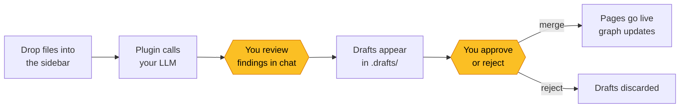

<div align="center">

# obsidian-brainfreeze

**Build persistent memory palaces from your documents**

Drop files. Review LLM-generated wiki pages. Watch your knowledge graph grow — with provenance tracking on every claim.

[](LICENSE)
[](https://obsidian.md)

</div>

---

An [Obsidian](https://obsidian.md) plugin that implements the [brainfreeze](https://github.com/abhimanyudogra/brainfreeze) enhanced LLM Wiki pattern. You bring your documents and your LLM API key. The plugin builds and maintains a provenance-tracked knowledge graph — and your data never leaves your machine except for LLM inference calls to the provider you choose.

## How it works



Yellow nodes are where you stay in the loop. The plugin never writes to your live wiki without your approval.

## Features

**Ingest panel** (left sidebar)
- Drag-and-drop file zone — copies files to `sources/`, triggers ingest
- Vault stats dashboard (page counts by category)
- FlexSearch-powered instant search across all wiki pages

**Review panel** (right sidebar)
- Draft cards with content previews
- Per-draft approve/reject or bulk merge-all/reject-all
- Click to preview any draft in the Obsidian editor

**In-memory search index**
- Two layers: structured frontmatter map + FlexSearch full-text
- Sub-5ms queries across hundreds of pages
- Incremental updates on file changes — no manual rebuild needed

**Structural lint** (12 checks, zero LLM cost)
- Broken wikilinks, orphan pages, missing provenance tags
- Provenance count mismatches, empty template sections
- Category-folder mismatches, active contradictions, stale dependencies
- **Inference-chain depth** — warns past 2 hops, errors past 3 (drift signal)
- **Orphan inferences** — `[^i]` tags with missing parent links or broken chains

**Provenance tracking with inference-DAG drift detection**
- Every factual claim tagged: `[^e]` extracted, `[^i]` inferred, `[^a]` ambiguous
- Every `[^i]` must cite its parents: `inferred from [^e1], [^e2] — rationale`
- Parent links turn provenance into a DAG that lint walks to compute depth per claim
- Catches *cumulative synthesis drift*: a vault that's structurally clean but
  has quietly become inference-on-inference after N ingests

**Vault health score** (drift-aware)
- 0–100 score with breakdown surfacing: avg inference depth, pages past depth 2,
  orphan inferences, stale pages, unresolved ambiguities, structural lint totals
- Signals "reconstruct time" before a vault silently drifts away from its sources

**Reconstruct operation**
- Archive current pages, re-ingest every source from `.manifest.json` in a single LLM call
- Escape hatch when incremental ingests have produced semantic drift

**Manifest-based delta ingest**
- SHA-256 hash per source file in `.manifest.json`
- Re-ingesting unchanged files is a no-op — no duplicates, no guessing

**Vault initialization**
- `initVault()` ships with the plugin — bundled `CLAUDE.md`, five page templates,
  category folders, manifest, log, index, gitignore all written on first click
- No copy-paste from the brainfreeze repo, no LLM freelancing folder structure

## Installation

### From Community Plugins (coming soon)

Settings → Community Plugins → Browse → search "Brainfreeze"

### Manual install

1. Download `main.js`, `manifest.json`, and `styles.css` from the [latest release](https://github.com/abhimanyudogra/obsidian-brainfreeze/releases)
2. Create `<your-vault>/.obsidian/plugins/brainfreeze/`
3. Copy the three files into that folder
4. Settings → Community Plugins → enable "Brainfreeze"

### Build from source

```bash
git clone https://github.com/abhimanyudogra/obsidian-brainfreeze.git
cd obsidian-brainfreeze
npm install
npm run build
# Copy main.js, manifest.json, styles.css to your vault's plugin folder
```

## Setup

1. Open Obsidian Settings → Brainfreeze
2. Select your **LLM provider** (Anthropic, OpenAI, or Ollama for fully local)
3. Enter your **API key** (stored locally in the vault, never sent to us — there is no "us")
4. Pick a **vault type** (Personal Finance, Career, Health, or Custom)
5. Copy the matching `CLAUDE.md` from [brainfreeze](https://github.com/abhimanyudogra/brainfreeze) into your vault root
6. Drop files into the sidebar and start ingesting

## Privacy

This plugin is designed around a single principle: **your data is yours**.

- **No servers.** There is no backend. No telemetry. No analytics. No accounts.
- **No data collection.** Your API key is stored in your vault's local `.obsidian/` config — it never leaves your machine except in direct API calls to your chosen LLM provider.
- **Fully open source.** Every line of code is auditable. If you don't trust the claim, read `src/main.ts`.
- **Ollama option.** For maximum privacy, select Ollama as your provider — runs entirely on your machine with zero external API calls.

## Supported LLM Providers

| Provider | Status | Notes |
|---|---|---|
| **Anthropic (Claude)** | Implemented | Recommended. Claude Sonnet 4 default. |
| **OpenAI (GPT)** | Planned | API key + model selector ready in settings |
| **Ollama (local)** | Planned | Zero cloud — runs on localhost:11434 |

## Architecture

```
src/
├── main.ts                 # Plugin entry — registers views, commands, file watchers
├── settings.ts             # Settings tab — API key, provider, vault type
├── views/
│   ├── IngestView.ts       # Left sidebar — drop zone, stats, search
│   └── ReviewView.ts       # Right sidebar — draft review + merge/reject
├── core/
│   ├── search-index.ts     # FlexSearch + frontmatter Map (two-layer index)
│   ├── manifest.ts         # .manifest.json SHA-256 tracking
│   └── lint.ts             # 10-check structural lint
├── llm/
│   ├── provider.ts         # Abstract LLM interface
│   ├── anthropic.ts        # Claude API via @anthropic-ai/sdk
│   └── types.ts            # Shared types
└── utils/
    └── crypto.ts           # SHA-256 hashing
```

Built on the [brainfreeze](https://github.com/abhimanyudogra/brainfreeze) pattern — 11 enhancements over Karpathy's base LLM Wiki including drafts-folder review gates, three-state provenance, typed YAML relations, and split lint. See the brainfreeze README for the full methodology.

## Roadmap

**Done**
- [x] Bundled schema + `initVault()` scaffolding (CLAUDE.md, templates, folders, manifest)
- [x] Reconstruct operation (archive + re-ingest from manifest)
- [x] Structural lint (12 checks including inference-DAG depth and orphan inferences)
- [x] Provenance inference-DAG parser (`src/core/provenance.ts`)
- [x] Drift-aware health score (inference depth, orphan inferences, stale, ambiguities)
- [x] Two-layer search index (frontmatter map + FlexSearch full-text)
- [x] Sidebar UI with drop zone, action grid, draft review, init flow

**Drift detection (phase 2 — in planning)**
- [ ] Semantic lint — LLM-backed verification of `[^e]` claims against current sources (drift mode 1)
- [ ] Per-draft "Verify" button in review panel for cheap, targeted checks
- [ ] Hash-based cache of semantic results in `.manifest.json`
- [ ] Sampling strategy (K highest-risk pages on each health compute) + freshness gauge

**Multi-format ingest**
- [ ] PDF support via Anthropic document blocks (base64-encoded, no pdfjs needed in plugin)
- [ ] DOCX / XLSX text extraction (mammoth, SheetJS, or document blocks if supported)
- [ ] Image support via vision content blocks
- [ ] Extend `provider.chat()` to accept content blocks, not just text strings

**Other LLM providers**
- [ ] OpenAI provider (`src/llm/openai.ts`)
- [ ] Ollama provider (`src/llm/ollama.ts`) — enables fully-local operation

**UX polish**
- [ ] Pre-ingest conversation modal (currently logs to console; the paradigm's "don't delegate understanding" checkpoint should be a blocking UI)
- [ ] Lint results modal (currently logs to console)
- [ ] Settings: model dropdown instead of free-text field
- [ ] Settings: vault-type-aware init — write `personal-finance` / `career` / `health` variants of CLAUDE.md based on selected type

**Correctness / paradigm compliance**
- [ ] Clean up pre-existing TypeScript errors (`Plugin.manifest` naming collision with `ManifestManager`, frontmatter `unknown` type narrowing in `search-index.ts`, `Buffer` → `ArrayBuffer` in `IngestView.ts`)
- [ ] Auto-run structural lint after every ingest (paradigm calls for this)
- [ ] Git commit per operation (ingest / refactor / prune)
- [ ] Enforce source-to-page routing tables from CLAUDE.md (currently LLM decides freely)

**Longer horizon**
- [ ] Vector embeddings for semantic search (v0.2)
- [ ] Obsidian Community Plugin submission

## Credits

- **[brainfreeze](https://github.com/abhimanyudogra/brainfreeze)** — the enhanced LLM Wiki pattern this plugin implements
- **[Andrej Karpathy](https://gist.github.com/karpathy/442a6bf555914893e9891c11519de94f)** — the original LLM Wiki concept
- **[Obsidian](https://obsidian.md)** — the knowledge platform this runs on

## License

MIT
